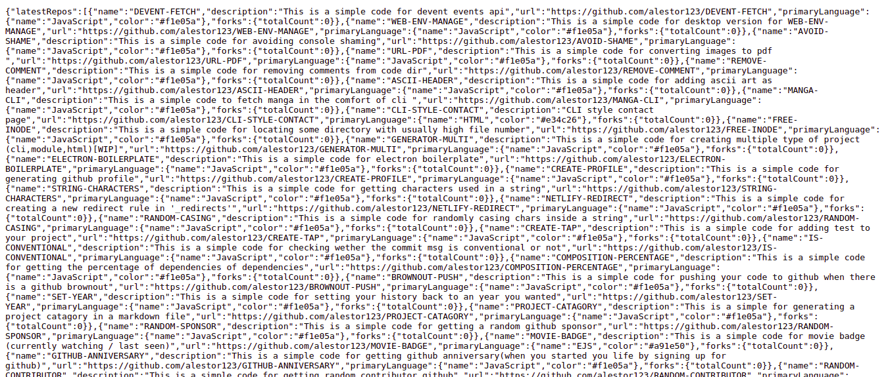
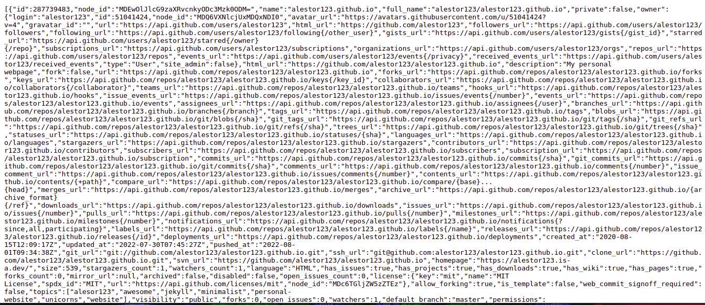

<h1 align=center>PROJECTS</h1>
> This is a simple code for fetching latest repos and projects (microservice)

<p align=center>

<a href="https://github.com/alestor123/PROJECTS/issues">
</a>

</p>

## 🚀 Usage
### With [vercel](https://now.sh)
```
$ git clone https://github.com/alestor123/PROJECTS.git
$ vercel deploy PROJECTS/ --env GHTOKEN=xxx
```

## Environment variables

Define the following environment variables:
- `defaultBrach` - Default branch(by default its ``` master ```)
- `GHUSERNAME` - Github Username
- `GHTOKEN` - [Personal access token.](https://github.com/settings/tokens/new)
- `MAXPAGE` - [Pagination Number](https://docs.github.com/en/rest/overview/resources-in-the-rest-api#pagination)(Optional)(9 by default)


# Screenshots    




## 💖 [Donate](https://alestor123.is-a.dev/donate)


## Author

👤 **Alestor Aldous**

- Twitter: [@alestor123](https://twitter.com/alestor123)
- Github: [@alestor123](https://github.com/alestor123)


## 📝 License
> MIT

Copyright © 2022 [Alestor Aldous](https://github.com/alestor123).<br />